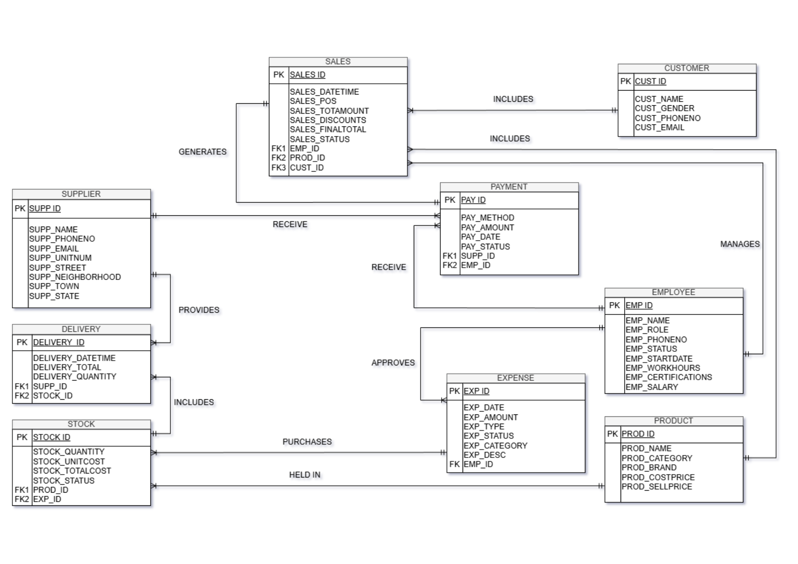
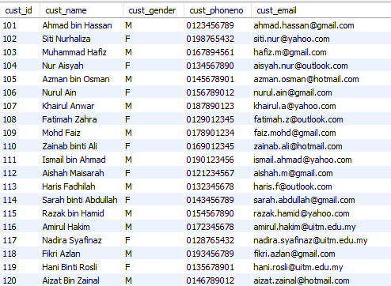
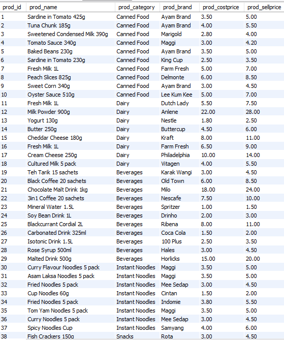

# retail-shop-inventory-system-v1
mysql project i did during semester 3 studying diploma in science computer along with my mates.

## Overview

This project is a MySQL-based Retail Shop Inventory Management System developed to manage products, stock, sales, suppliers, employees, deliveries, expenses, payments, and customers.

## Objectives

* Track inventory levels and stock status
* Record sales transactions
* Manage supplier deliveries and payments
* Monitor expenses and employee information
* Generate business reports

## Technologies Used

* MySQL
* SQL
* MySQL Workbench
* draw.io

## Database Tables

* Customer
* Product
* Stock
* Sales
* Supplier
* Delivery
* Payment
* Employee
* Expense

## Entity Relationship Diagram

## Customer Table

## Product Table

## Features

* Inventory management
* Sales tracking
* Customer management
* Supplier management
* Employee records
* Expense tracking
* Delivery management
* Business reporting

## Repository Structure

database/

* schema.sql
* sample_data.sql
* ERD.png

queries/

* sales_queries.sql
* inventory_queries.sql
* supplier_queries.sql
* employee_queries.sql
* reports.sql

screenshots/

* customer-table.png
* delivery-table.png
* employee-table.png
* expense-table.png
* payment-table.png
* product-table.png
* sales-table.png
* supplpier-table.png

documentation/

* project-report

## How to Run

1. Create a new MySQL database.
2. Import `schema.sql`.
3. Import `sample_data.sql`.
4. Execute queries from the `queries` folder.

## Author

Adam Iskandar
